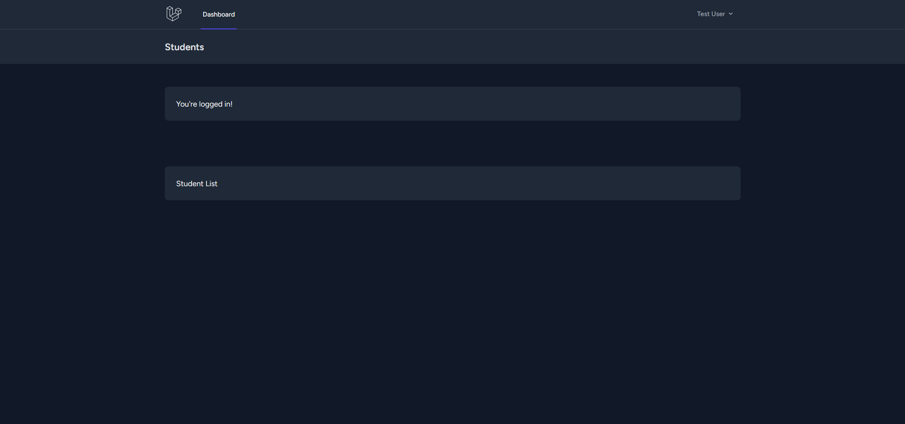
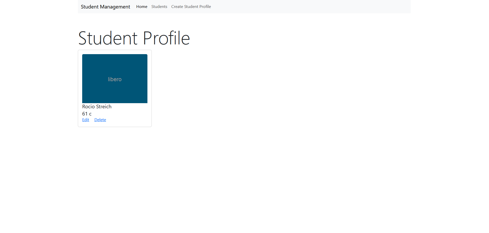
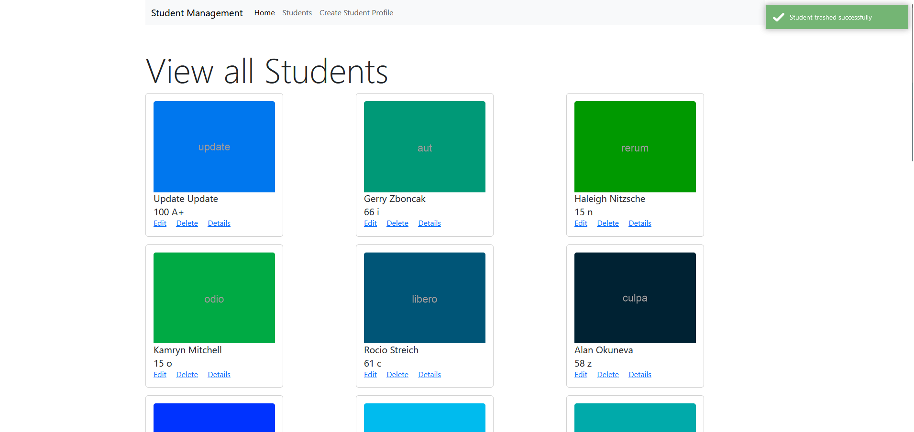

# php-assignment3

---

Student management system based on the database we worked on in week 5. This system has CRUD operations on a database table named 'students'. The system includes features for adding, editing, deleting, and viewing student records, with each record containing information such as first name, last name, marks, grade, and an optional image URL. Additionally, the project incorporates user authentication and authorization using Laravel Breeze, ensuring secure access control to the CRUD functionalities based on user roles.

The database schema consists of a single table named 'students', with columns for first name, last name, marks, grade, and imageURL. It also has a users table that defines roles for 'admin', and 'users'. This feature restricts access to features such as edit, update and delete.

---

Login

Dashboard

Student List

Update student

Add student

Student profile

Delete student

---

The one thing that I was unable to do was figure out authorization and defining roles to specific users. 

